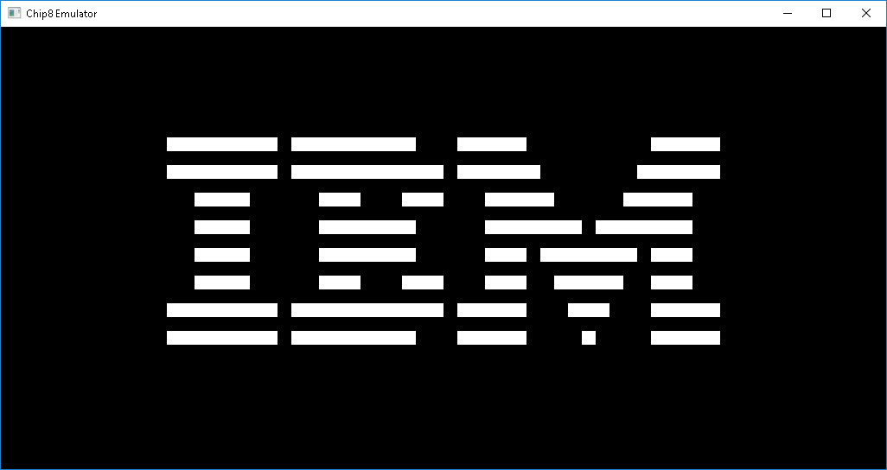

# Chip-8
A Chip-8 emulator written in C# (.NET Core)

*IBM logo*

"CHIP-8 is an interpreted programming language, developed by Joseph Weisbecker. It was initially used on the COSMAC VIP and Telmac 1800 8-bit microcomputers in the mid-1970s. CHIP-8 programs are run on a CHIP-8 virtual machine. It was made to allow video games to be more easily programmed for these computers." - Wikipedia

I wrote this emulator to get a better understanding for how emulators work. The emulator uses OpenTK for rendering and keyboard input. Keyboard keys 0-9, A-F maps to the corresponding chip8 keys.

## Compiling and running

Compile:

Built with VS2019 and the OpenTK nuget package.

Run:

Run chip8.exe and drag and drop the ROM to the main window.

Keyboard shortcuts:

[Esc] = Exit

P     = Pause / Play execution

S     = Single step

O     = Show / hide console

R     = Dump registers to console

G     = Dump screen contents to console

M     = Print memory contents to console

## References
I used these resources for help and inspiration:

http://en.wikipedia.org/wiki/CHIP-8

http://devernay.free.fr/hacks/chip8/C8TECH10.HTM

https://github.com/bradford-hamilton/chippy/

https://github.com/BluestormDNA/ProjectPSX
